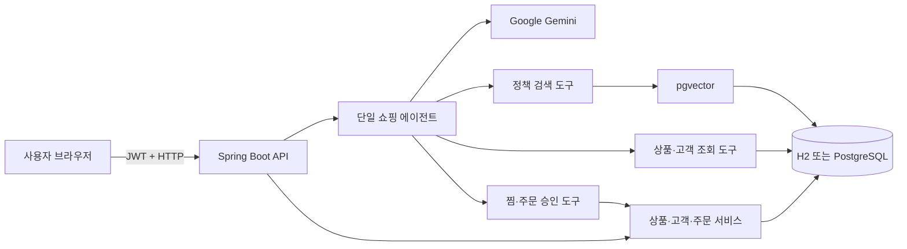

# AI SHOPPING

기존 Spring Boot 쇼핑몰 서비스에 Google Gemini와 Spring AI 기반의 AI 챗봇 기능을 추가한 프로젝트입니다.

AI 챗봇을 통해 상품 탐색부터 개인화 추천, 찜, 주문, 쇼핑몰 정책 상담까지 하나의 웹 화면에서 처리할 수 있습니다. 챗봇은 실제 데이터베이스의 상품·재고·고객 정보를 도구로 조회한 뒤 답변합니다.

AI가 주문이나 찜처럼 데이터를 변경하려면 즉시 실행하지 않고 확인 요청을 먼저 생성합니다. 사용자가 웹 화면에서 내용을 확인한 뒤 승인해야 실제 작업이 처리됩니다.

## 주요 기능

### 쇼핑몰

- 회원가입 및 JWT 로그인
- 신규 회원 1,000,000포인트 지급
- 추천인 입력 시 가입자와 추천인에게 각각 10,000포인트 추가 지급
- 상품 목록 및 상세 조회
- 상품명, 설명, 브랜드, 태그, 가격, 카테고리 검색
- 찜 추가 및 삭제
- 포인트와 재고를 검증하는 상품 주문
- 주문 취소 시 포인트와 재고 복구
- 내 포인트, 찜 목록, 구매 내역 조회

### AI 쇼핑 컨시어지

- 자연어 상품 추천
- 고객의 포인트, 찜, 구매 내역을 반영한 개인화 응답
- 하나의 도구 기반 쇼핑 에이전트가 상품·주문·정책 요청을 통합 처리
- 정책 질문에만 pgvector 검색 도구를 호출해 불필요한 임베딩 요청 감소
- 대화별 최근 20개 메시지 기억
- 상품 정보와 배송·교환·환불 정책 RAG 검색
- 실제 DB에 존재하는 상품만 반환하는 구조화 추천 API
- 찜·주문·취소 작업에 10분 유효 확인 토큰 적용
- Google Gemini 임베딩과 PostgreSQL pgvector 기반 지식 색인

### 웹 UI

- 데스크톱과 모바일 반응형 화면
- 회원가입 및 로그인
- 상품 검색, 가격·카테고리 필터
- 찜, 주문, 주문 취소
- AI 채팅과 빠른 질문
- AI 승인 대기 작업 확인 및 실행
- 웹 버튼을 이용한 상품·정책 재색인
- JWT를 브라우저 탭의 `sessionStorage`에 보관
- 한글 입력기 조합 중 Enter가 중복 전송되지 않도록 처리

## 기술 스택

| 영역 | 기술 |
|---|---|
| Backend | Java 21, Spring Boot 4.1, Spring MVC |
| Security | Spring Security, JWT, BCrypt |
| Persistence | Spring Data JPA, H2, PostgreSQL 18 |
| AI | Spring AI 2.0, Google Gemini |
| Vector search | pgvector, Spring AI Vector Store |
| API documentation | Springdoc OpenAPI, Swagger UI |
| Frontend | HTML, CSS, Vanilla JavaScript |
| Build and test | Gradle Wrapper, JUnit 5, MockMvc |

## 동작 구조



AI는 가격, 재고, 포인트와 구매 내역을 모델의 기억에 의존해 생성하지 않습니다. Spring AI Tool을 통해 현재 DB를 조회하며, 정책 답변에는 pgvector에 저장된 상품·정책 문서를 사용합니다.

### 단일 도구 에이전트를 사용하는 이유

초기 구조는 Gemini 오케스트레이터가 상품 추천, 주문 지원, 고객 지원 에이전트 중 하나를 다시 호출하는 다중 에이전트 방식이었습니다. 이 방식은 역할이 명확하지만 사용자 질문 한 번에도 여러 에이전트 호출이 중첩되어 응답 시간과 Gemini 사용량이 빠르게 증가합니다.

현재는 자연어 이해를 Java 키워드 규칙에 맡기지 않습니다. 하나의 Gemini 쇼핑 에이전트가 질문의 의미를 해석하고 필요한 Java 도구를 선택합니다. Java 도구와 서비스는 모델의 결정을 그대로 신뢰하지 않고 실제 상품, 고객 권한, 재고, 포인트와 주문 수량을 다시 검증합니다.

```text
사용자 질문
→ Gemini 쇼핑 에이전트가 필요한 도구 결정
→ Java가 DB 조회 또는 변경 승인 요청 생성
→ Gemini가 도구 결과로 최종 답변 작성
```

도구가 필요 없는 일반 대화는 Gemini 생성 요청 한 번으로 끝날 수 있습니다. 상품·고객 조회나 승인 요청처럼 도구가 필요한 질문은 보통 도구 선택과 최종 답변을 위해 두 번의 모델 왕복이 발생할 수 있습니다. 중요한 목표는 모든 질문을 무조건 한 번으로 제한하는 것이 아니라, 전문 에이전트를 다시 호출하던 불필요한 중첩을 제거하는 것입니다.

| 요청 종류 | 처리 방식 | 예상 AI 요청 특성 |
|---|---|---|
| 일반 쇼핑 대화 | Gemini가 바로 답변 | 생성 요청 1회 수준 |
| 상품 추천·계정 조회 | Gemini가 Java 조회 도구 선택 | 생성 요청 1~2회 수준 |
| 배송·환불 정책 | Gemini가 필요할 때만 정책 검색 | 임베딩 검색 + 생성 요청 |
| 웹 버튼 주문·찜 | Java REST API가 직접 처리 | AI 요청 없음 |
| 채팅을 통한 주문·찜 | Gemini가 승인 요청 도구 선택 | 생성 요청 1~2회 수준 |

주문, 찜과 취소는 AI가 직접 실행하지 않습니다. 에이전트는 10분짜리 확인 토큰만 생성하고, 사용자가 승인한 뒤 Java 서비스가 실행 시점의 업무 조건을 다시 검사합니다.

## 실행 요구사항

- Java 21
- Docker 및 Docker Compose — AI 프로필에서 PostgreSQL/pgvector 실행에 필요
- Google Gemini API 키 — AI 채팅과 임베딩에 필요

별도의 Gradle 설치는 필요하지 않습니다. 저장소에 포함된 Gradle Wrapper를 사용합니다.

## 빠른 시작: AI 쇼핑몰

### 1. PostgreSQL과 pgvector 실행

```bash
docker compose up -d
```

컨테이너 상태를 확인합니다.

```bash
docker compose ps
```

기본 접속 정보는 다음과 같습니다.

| 항목 | 기본값 |
|---|---|
| Host | `localhost` |
| Host port | `5433` |
| Database | `skala_shop` |
| Username | `postgres` |
| Password | `postgres` |

호스트 포트는 로컬 PostgreSQL의 기본 포트 `5432`와 충돌하지 않도록 `5433`을 사용합니다.

### 2. Gemini API 키와 AI 프로필로 서버 실행

API 키를 파일에 저장하지 않고 실행할 때 직접 입력하려면 다음 명령을 사용합니다.

```bash
GOOGLE_API_KEY=실제_Gemini_API_키 SPRING_PROFILES_ACTIVE=ai ./gradlew bootRun
```

키 값에 공백이나 특수 문자가 있다면 작은따옴표로 감쌉니다.

```bash
GOOGLE_API_KEY='실제_Gemini_API_키' SPRING_PROFILES_ACTIVE=ai ./gradlew bootRun
```

정상적으로 실행되면 기본 포트는 `8080`입니다.

### 3. 웹 접속

[http://localhost:8080](http://localhost:8080)에 접속합니다.

1. 새 아이디와 비밀번호로 회원가입합니다.
2. 로그인하면 JWT가 현재 브라우저 탭에 저장됩니다.
3. AI 패널 오른쪽 위의 재색인 버튼을 한 번 누릅니다.
4. `3만원 이하 재택근무 상품을 추천해줘`와 같이 질문합니다.
5. AI가 찜이나 주문을 제안하면 승인 카드의 `확인하고 실행` 버튼을 누릅니다.

재색인은 상품 정보와 `src/main/resources/documents/shop-policy.txt`를 Gemini 임베딩으로 변환해 pgvector에 저장합니다. 상품이나 정책 문서를 변경한 뒤에는 다시 재색인해야 최신 내용이 검색됩니다.

## 일반 쇼핑 API만 실행

Gemini와 PostgreSQL 없이 기존 쇼핑 기능만 확인할 때 사용합니다.

```bash
./gradlew bootRun
```

일반 프로필에서는 다음과 같이 동작합니다.

- 인메모리 H2 데이터베이스 사용
- 애플리케이션 종료 시 데이터 초기화
- AI 컨트롤러와 벡터 저장소 비활성화
- 웹의 AI 상태가 `AI 프로필 꺼짐`으로 표시
- 상품, 회원, 찜, 주문 기능은 정상 사용 가능

## 프로필 비교

| 항목 | 일반 프로필 | `ai` 프로필 |
|---|---|---|
| 실행 명령 | `./gradlew bootRun` | `GOOGLE_API_KEY=... SPRING_PROFILES_ACTIVE=ai ./gradlew bootRun` |
| 쇼핑 DB | H2 인메모리 | PostgreSQL |
| 데이터 유지 | 서버 종료 시 삭제 | Docker 볼륨에 유지 |
| AI 채팅 | 비활성 | Gemini |
| 임베딩/RAG | 비활성 | Gemini Embedding + pgvector |
| H2 Console | 사용 가능 | 비활성 |

## 환경변수

AI 프로필의 설정은 `application-ai.yml`에서 다음 환경변수를 읽습니다.

| 환경변수 | 필수 여부 | 기본값 | 설명 |
|---|---|---|---|
| `GOOGLE_API_KEY` | 필수 | 없음 | Google Gemini API 키 |
| `GEMINI_CHAT_MODEL` | 선택 | `gemini-2.5-flash` | 채팅 모델 |
| `GEMINI_EMBEDDING_MODEL` | 선택 | `gemini-embedding-001` | 임베딩 모델 |
| `GEMINI_EMBEDDING_DIMENSIONS` | 선택 | `1536` | 임베딩과 pgvector 차원 |
| `SHOP_DB_URL` | 선택 | `jdbc:postgresql://localhost:5433/skala_shop` | PostgreSQL JDBC URL |
| `SHOP_DB_USERNAME` | 선택 | `postgres` | DB 사용자 |
| `SHOP_DB_PASSWORD` | 선택 | `postgres` | DB 비밀번호 |
| `JWT_SECRET` | 운영 환경 권장 | 개발용 기본값 | JWT 서명 키 |

`.env.example`은 필요한 값의 예시만 제공합니다. Spring Boot는 이 프로젝트의 `.env` 파일을 자동으로 읽지 않으므로, 현재 실행 방식에서는 환경변수를 명령에 직접 전달해야 합니다. `.env`와 실제 API 키는 Git에 커밋하지 마세요.

임베딩 모델이나 `GEMINI_EMBEDDING_DIMENSIONS`를 바꾸면 기존 pgvector 테이블의 차원과 달라질 수 있습니다. 기존 데이터베이스를 계속 사용할 때는 모델과 차원 값을 동일하게 유지하세요.

## JWT 인증

다음 경로는 인증 없이 사용할 수 있습니다.

- `/`, `/index.html`, `/styles.css`, `/app.js`
- `/api/health`
- `/api/products/**`
- `POST /api/customers`
- `POST /api/customers/login`
- `/swagger-ui/**`, `/v3/api-docs/**`

그 외 요청에는 로그인 응답의 토큰이 필요합니다.

```http
Authorization: Bearer {accessToken}
```

JWT 기본 유효 시간은 60분입니다. 웹에서는 토큰을 `sessionStorage`에 저장하므로 다른 탭과 공유되지 않으며, 탭을 닫거나 로그아웃하면 제거됩니다.

현재 상품 생성·수정·삭제 API도 `/api/products/**` 규칙에 따라 공개되어 있습니다. 개발·학습 환경을 위한 설정이므로 실제 운영 환경에서는 관리자 권한을 분리해야 합니다.

## API 사용 예시

아래 예시는 서버가 `http://localhost:8080`에서 실행 중이라고 가정합니다.

### 회원가입

비밀번호는 API 기준 최소 4자이며 웹 회원가입 화면에서는 최소 8자를 요구합니다. 추천인이 없다면 `referrerId`를 생략하거나 `null`로 보냅니다.

```bash
curl -X POST http://localhost:8080/api/customers \
  -H 'Content-Type: application/json' \
  -d '{
    "customerId": "harim",
    "customerPassword": "password123",
    "referrerId": null
  }'
```

### 로그인

```bash
curl -X POST http://localhost:8080/api/customers/login \
  -H 'Content-Type: application/json' \
  -d '{
    "customerId": "harim",
    "customerPassword": "password123"
  }'
```

응답 예시:

```json
{
  "accessToken": "eyJ...",
  "tokenType": "Bearer",
  "expiresInMinutes": 60
}
```

이후 예시에서 사용할 토큰을 환경변수로 지정합니다.

```bash
TOKEN='로그인_응답의_accessToken'
```

### 내 정보 조회

```bash
curl http://localhost:8080/api/customers/me \
  -H "Authorization: Bearer $TOKEN"
```

### 상품 검색

키워드는 상품명, 설명, 브랜드와 태그에서 검색합니다. `query`, `maxPrice`, `category`는 모두 선택 항목입니다.

```bash
curl 'http://localhost:8080/api/products/search?query=재택근무&maxPrice=30000&category=주변기기'
```

### 상품 등록

```bash
curl -X POST http://localhost:8080/api/products \
  -H 'Content-Type: application/json' \
  -d '{
    "productName": "노트북 거치대",
    "productPrice": 25000,
    "stockQuantity": 30,
    "description": "높이와 각도를 조절할 수 있는 알루미늄 거치대",
    "category": "액세서리",
    "brand": "AI SHOPPING",
    "tags": "재택근무,노트북,거치대"
  }'
```

상품을 등록하거나 수정했다면 AI가 변경된 상품을 찾을 수 있도록 재색인합니다.

### 찜 추가와 삭제

```bash
curl -X POST http://localhost:8080/api/wishes/1 \
  -H "Authorization: Bearer $TOKEN"

curl -X DELETE http://localhost:8080/api/wishes/1 \
  -H "Authorization: Bearer $TOKEN"
```

### 주문과 취소

```bash
curl -X POST http://localhost:8080/api/customers/order \
  -H "Authorization: Bearer $TOKEN" \
  -H 'Content-Type: application/json' \
  -d '{"productId": 1, "quantity": 2}'

curl -X POST http://localhost:8080/api/customers/cancel \
  -H "Authorization: Bearer $TOKEN" \
  -H 'Content-Type: application/json' \
  -d '{"productId": 1, "quantity": 1}'
```

주문 시 포인트와 재고가 감소합니다. 취소 시 취소 수량만큼 포인트와 재고가 복구됩니다.

### AI 지식 재색인

AI 프로필에서만 사용할 수 있습니다.

```bash
curl -X POST http://localhost:8080/api/ai/knowledge/reindex \
  -H "Authorization: Bearer $TOKEN"
```

응답 예시:

```json
{
  "indexedDocuments": 4
}
```

문서 수는 현재 상품과 정책 파일 구성에 따라 달라질 수 있습니다.

### AI 채팅

```bash
curl -X POST http://localhost:8080/api/ai/chat \
  -H "Authorization: Bearer $TOKEN" \
  -H 'Content-Type: application/json' \
  -d '{
    "message": "3만원 이하 재택근무용 상품을 추천해줘",
    "conversationId": "shopping-1"
  }'
```

`conversationId`가 같으면 이전 대화를 이어갑니다. 서버는 고객별 대화가 섞이지 않도록 인증된 고객 ID를 대화 ID 앞에 내부적으로 결합합니다.

### 구조화 상품 추천

자연어 설명 대신 화면이나 다른 서비스가 사용하기 쉬운 상품 배열이 필요할 때 사용합니다.

```bash
curl -X POST http://localhost:8080/api/ai/recommendations \
  -H "Authorization: Bearer $TOKEN" \
  -H 'Content-Type: application/json' \
  -d '{"query": "3만원 이하 재택근무용 상품"}'
```

응답의 상품 ID는 AI가 임의로 만든 값이 아니라 현재 DB에 존재하는 ID인지 검증됩니다.

### AI 승인 대기 작업

AI에게 `무선 마우스 한 개 주문해줘`와 같이 요청하면 바로 주문하지 않고 승인 대기 작업을 생성합니다.

```bash
curl http://localhost:8080/api/ai/actions \
  -H "Authorization: Bearer $TOKEN"
```

응답 예시:

```json
[
  {
    "confirmationToken": "550e8400-e29b-41d4-a716-446655440000",
    "type": "PLACE_ORDER",
    "productId": 1,
    "quantity": 1,
    "expiresAt": "2026-09-06T01:10:00Z",
    "confirmationMessage": "'무선 마우스' 1개를 총 15000포인트에 주문할까요?"
  }
]
```

내용을 확인한 뒤 토큰으로 실행합니다.

```bash
curl -X POST http://localhost:8080/api/ai/actions/확인_토큰/confirm \
  -H "Authorization: Bearer $TOKEN"
```

확인 토큰은 다음 규칙을 적용합니다.

- 생성한 고객만 사용할 수 있습니다.
- 10분 동안 유효합니다.
- 한 번만 사용할 수 있습니다.
- 실행 시점에 포인트, 재고와 주문 수량을 다시 검증합니다.
- 서버가 재시작되면 메모리의 미승인 작업은 사라집니다.

## API 목록

### 시스템과 상품

| Method | Path | 인증 | 설명 |
|---|---|---|---|
| `GET` | `/api/health` | 불필요 | 애플리케이션 상태 확인 |
| `GET` | `/api/products` | 불필요 | 전체 상품 조회 |
| `GET` | `/api/products/search` | 불필요 | 키워드·가격·카테고리 검색 |
| `GET` | `/api/products/{id}` | 불필요 | 상품 상세 조회 |
| `POST` | `/api/products` | 불필요 | 상품 등록 |
| `PUT` | `/api/products/{id}` | 불필요 | 상품 수정 |
| `DELETE` | `/api/products/{id}` | 불필요 | 상품 삭제 |

### 고객, 주문과 찜

| Method | Path | 인증 | 설명 |
|---|---|---|---|
| `POST` | `/api/customers` | 불필요 | 회원가입 |
| `POST` | `/api/customers/login` | 불필요 | 로그인 및 JWT 발급 |
| `GET` | `/api/customers` | 필요 | 고객 목록 조회 |
| `GET` | `/api/customers/me` | 필요 | 내 포인트와 구매 내역 조회 |
| `PUT` | `/api/customers/me` | 필요 | 내 포인트 수정 |
| `DELETE` | `/api/customers/me` | 필요 | 회원 탈퇴 |
| `POST` | `/api/customers/order` | 필요 | 상품 주문 |
| `POST` | `/api/customers/cancel` | 필요 | 주문 취소 |
| `GET` | `/api/wishes` | 필요 | 내 찜 목록 조회 |
| `POST` | `/api/wishes/{productId}` | 필요 | 찜 추가 |
| `DELETE` | `/api/wishes/{productId}` | 필요 | 찜 삭제 |

### AI

AI API는 `ai` 프로필에서만 등록됩니다.

| Method | Path | 인증 | 설명 |
|---|---|---|---|
| `POST` | `/api/ai/chat` | 필요 | AI 쇼핑 대화 |
| `POST` | `/api/ai/recommendations` | 필요 | 구조화 상품 추천 |
| `POST` | `/api/ai/knowledge/reindex` | 필요 | 상품과 정책 재색인 |
| `GET` | `/api/ai/actions` | 필요 | 내 승인 대기 작업 조회 |
| `POST` | `/api/ai/actions/{token}/confirm` | 필요 | 승인 작업 실행 |

Swagger UI에서도 전체 요청과 응답 스키마를 확인할 수 있습니다.

- Swagger UI: [http://localhost:8080/swagger-ui/index.html](http://localhost:8080/swagger-ui/index.html)
- OpenAPI JSON: [http://localhost:8080/v3/api-docs](http://localhost:8080/v3/api-docs)

## 데이터와 저장 수명

| 데이터 | 저장 위치 | 서버 재시작 후 유지 |
|---|---|---|
| 일반 프로필 상품·회원·주문 | H2 메모리 | 유지되지 않음 |
| AI 프로필 상품·회원·주문 | PostgreSQL Docker 볼륨 | 유지 |
| AI 벡터 문서 | PostgreSQL `vector_store` | 유지 |
| 채팅 메모리 | 애플리케이션 메모리 | 유지되지 않음 |
| AI 승인 대기 작업 | 애플리케이션 메모리 | 유지되지 않음 |
| 웹 JWT | 브라우저 `sessionStorage` | 현재 탭에서만 유지 |

빈 데이터베이스에는 다음 샘플 상품 3개가 중복 없이 추가됩니다.

| 상품 | 가격 | 초기 재고 | 카테고리 |
|---|---:|---:|---|
| 무선 마우스 | 15,000 P | 100 | 주변기기 |
| 블루투스 키보드 | 29,000 P | 100 | 주변기기 |
| USB 허브 | 39,000 P | 100 | 액세서리 |

따라서 상품을 별도로 등록하지 않았다면 웹 화면에 3개만 표시되는 것이 정상입니다. 화면의 재고는 현재 PostgreSQL 값을 보여주므로 주문 이후에는 초기 재고와 달라질 수 있습니다. 상품 표시 순서는 DB 조회 결과에 따라 달라질 수 있습니다.

## 오류 응답

업무 오류와 입력 오류는 공통 JSON 형식으로 반환됩니다.

```json
{
  "timestamp": "2026-09-06T10:00:00",
  "status": 409,
  "code": "INSUFFICIENT_STOCK",
  "message": "상품 재고가 부족합니다.",
  "path": "/api/customers/order"
}
```

대표 오류 코드는 다음과 같습니다.

| Code | 의미 |
|---|---|
| `NOT_AUTHENTICATED` | JWT가 없거나 유효하지 않음 |
| `INVALID_CREDENTIALS` | 아이디 또는 비밀번호 불일치 |
| `PRODUCT_NOT_FOUND` | 상품을 찾을 수 없음 |
| `INSUFFICIENT_STOCK` | 주문 수량보다 재고가 적음 |
| `INSUFFICIENT_FUNDS` | 포인트 부족 |
| `ORDER_NOT_FOUND` | 취소할 주문이 없음 |
| `INSUFFICIENT_QUANTITY` | 주문 수량보다 많이 취소함 |
| `WISH_DUPLICATED` | 이미 찜한 상품 |
| `AI_QUOTA_EXCEEDED` | Gemini 무료 또는 설정된 API 할당량 소진 |
| `INVALID_REQUEST` | 요청 값 또는 AI 확인 토큰이 올바르지 않음 |

## 프로젝트 구조

```text
src/main/java/com/skala/shop
├── ai
│   ├── action       # AI 승인 대기 작업과 확인 실행
│   ├── agent        # 단일 도구 기반 쇼핑 에이전트
│   ├── controller   # AI REST API
│   ├── dto          # AI 요청·응답 모델
│   ├── knowledge    # 상품·정책 벡터 색인
│   └── tool         # DB 조회 및 작업 제안 도구
├── config           # Security와 OpenAPI 설정
├── controller       # 상품, 고객, 찜, 상태 REST API
├── dto              # 쇼핑 API 요청·응답 모델
├── entity           # JPA 엔티티
├── exception        # 공통 오류 처리
├── repository       # Spring Data JPA 저장소
├── security         # JWT 생성과 인증 필터
└── service          # 쇼핑 비즈니스 로직

src/main/resources
├── application.yml       # H2 기반 기본 프로필
├── application-ai.yml    # Gemini/PostgreSQL AI 프로필
├── data.sql              # 샘플 상품
├── documents
│   └── shop-policy.txt   # RAG 쇼핑몰 정책
└── static
    ├── index.html        # AI SHOPPING 웹 화면
    ├── styles.css        # 반응형 디자인
    └── app.js            # JWT, 쇼핑 API와 AI UI 연동
```

## 테스트

전체 테스트를 실행합니다.

```bash
./gradlew test
```

테스트에는 다음 항목이 포함됩니다.

- 애플리케이션 컨텍스트 로딩
- 회원가입, 로그인과 JWT 인증
- 상품 자연어 속성 검색
- 주문 재고 및 포인트 규칙
- 공개 웹 화면 제공
- AI 프로필 컨텍스트 로딩
- 승인 토큰의 고객 격리, 일회성 실행과 만료 처리

테스트 결과 HTML은 실행 후 `build/reports/tests/test/index.html`에서 확인할 수 있습니다.

## 운영 및 종료

Spring Boot 서버는 실행 중인 터미널에서 `Ctrl + C`로 종료합니다.

PostgreSQL 컨테이너를 종료하되 데이터를 유지하려면 다음 명령을 사용합니다.

```bash
docker compose down
```

다음 실행에서 `docker compose up -d`를 사용하면 기존 Docker 볼륨의 데이터가 다시 연결됩니다.

## 문제 해결

### `GOOGLE_API_KEY` 오류가 발생하는 경우

AI 프로필 실행 명령에 실제 키가 포함됐는지 확인합니다.

```bash
GOOGLE_API_KEY='실제키' SPRING_PROFILES_ACTIVE=ai ./gradlew bootRun
```

일반 프로필에서는 Gemini 키가 필요하지 않습니다.

### 웹에서 `AI 프로필 꺼짐`으로 표시되는 경우

서버가 일반 프로필로 실행된 상태입니다. 서버를 종료하고 `SPRING_PROFILES_ACTIVE=ai`를 포함해 다시 실행합니다.

### PostgreSQL 연결에 실패하는 경우

컨테이너와 포트를 확인합니다.

```bash
docker compose ps
docker compose logs postgres
```

기본 JDBC 주소는 `jdbc:postgresql://localhost:5433/skala_shop`입니다.

### 8080 포트가 이미 사용 중인 경우

사용 중인 프로세스를 확인합니다.

```bash
lsof -nP -iTCP:8080 -sTCP:LISTEN
```

기존 서버를 유지하면서 다른 포트로 실행하려면 다음과 같이 지정합니다.

```bash
SERVER_PORT=8081 GOOGLE_API_KEY='실제키' SPRING_PROFILES_ACTIVE=ai ./gradlew bootRun
```

이 경우 웹 주소는 `http://localhost:8081`입니다.

### 화면 변경이 보이지 않는 경우

Spring Boot 서버를 재시작한 뒤 브라우저에서 강력 새로고침을 실행합니다.

- macOS: `Cmd + Shift + R`
- Windows/Linux: `Ctrl + Shift + R`

### AI가 새 상품이나 정책을 찾지 못하는 경우

로그인 후 웹 AI 패널의 재색인 버튼을 누르거나 다음 API를 호출합니다.

```bash
curl -X POST http://localhost:8080/api/ai/knowledge/reindex \
  -H "Authorization: Bearer $TOKEN"
```

### AI 확인 작업이 사라진 경우

확인 작업은 생성 후 10분이 지나거나 서버가 재시작되면 사라집니다. AI에게 동일한 요청을 다시 보내 새 확인 작업을 생성하세요.

## 보안 주의사항

- Gemini API 키와 운영용 `JWT_SECRET`을 Git에 커밋하지 마세요.
- 운영 환경에서는 개발용 DB 계정과 비밀번호를 반드시 변경하세요.
- HTTPS 없이 인터넷에 공개하지 마세요.
- 현재 공개된 상품 변경 API에는 관리자 인증을 추가해야 합니다.
- 현재 채팅 메모리와 승인 작업은 단일 서버 메모리 기반입니다. 다중 서버 운영 시 Redis 같은 공유 저장소가 필요합니다.
